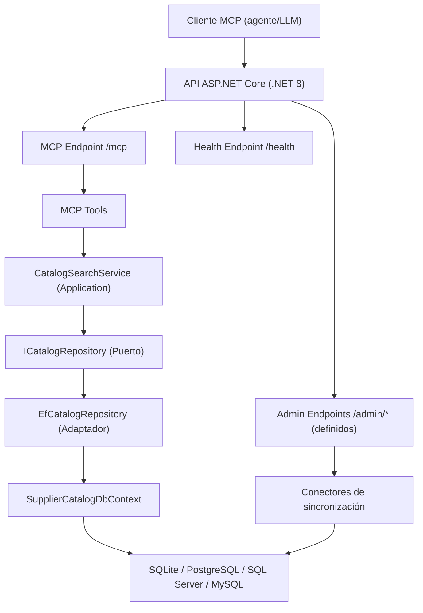
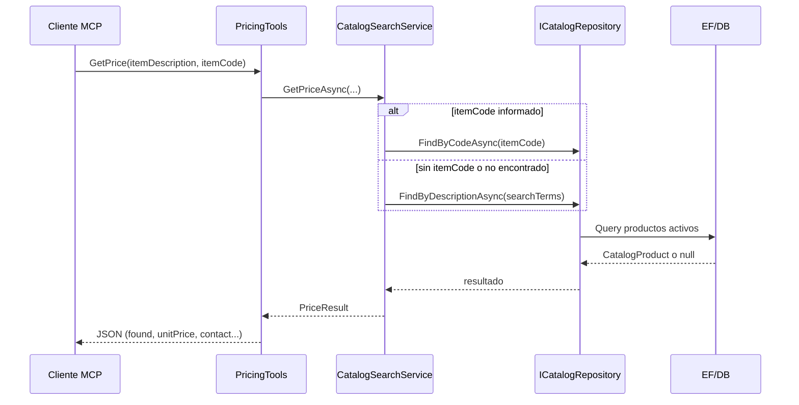
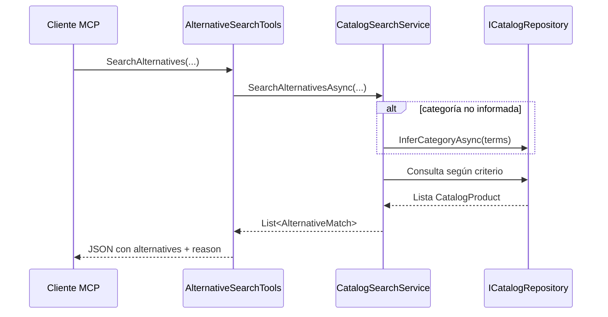
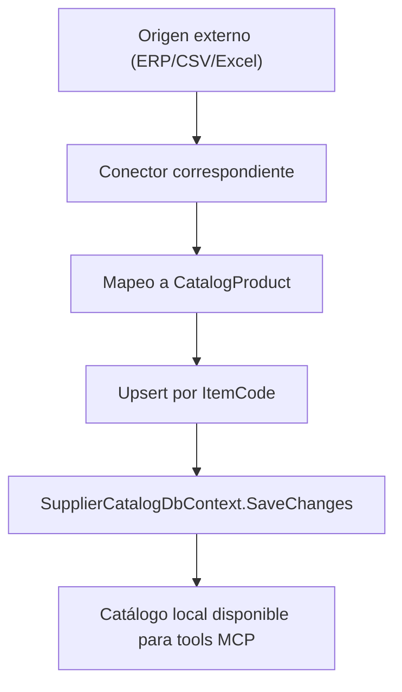

# Arquitectura — IgnakeeAI MCP Supplier Server

## 1. Propósito del sistema

`IgnakeeAI.McpServer.Supplier` es el servicio que un proveedor despliega para que los agentes de Legio consulten su catálogo mediante MCP. El proveedor conserva el control de sus datos, ERP y credenciales; Legio accede únicamente a la interfaz MCP autorizada.

Está diseñado para:

- Exponer herramientas MCP para:
  - consulta de precio (`GetPrice`)
  - búsqueda de alternativas (`SearchAlternatives`)
  - disponibilidad (`CheckAvailability`)
  - datos de atención (`GetBusinessHours`)
- Centralizar información de catálogo desde múltiples fuentes:
  - base de datos local (principal)
  - importación por `CSV`
  - importación por `Excel`
  - sincronización desde ERP (`Odoo` o `SAP`)
- Ofrecer una integración HTTP segura (`/mcp`) con salud del servicio (`/health`).

La frontera de confianza es explícita: Legio usa una credencial MCP con scopes de lectura y
el proveedor usa una credencial administrativa separada para sincronizar el catálogo.

---

## 2. Estilo arquitectónico

Se aplica una arquitectura por capas con enfoque puertos/adaptadores (hexagonal ligera):

- **Dominio**: entidades y reglas derivadas (`CatalogProduct`, `EffectivePrice`, `DiscountPercent`).
- **Aplicación**: casos de uso y contratos (`CatalogSearchService`, `ICatalogRepository`, `ISupplierConfig`).
- **Infraestructura**: persistencia EF Core, conectores ERP/CSV/Excel, configuración.
- **Entrada MCP/API**: registro de tools MCP y exposición HTTP.

### 2.1 Vista de componentes



Flujo de lectura contractual:

```text
Cliente MCP de Legio
        ?
HTTP MCP /mcp
        ?
McpTools
        ?
CatalogSearchService
        ?
ICatalogRepository
        ?
SupplierCatalogDbContext
```

El endpoint `/mcp` se autentica con una credencial de cliente MCP y scopes de
lectura. Los endpoints `/admin/*` están separados y requieren rol
`supplier-admin`. CORS se limita mediante `Cors:AllowedOrigins` y no sustituye
la autenticación.

---

## 3. Estructura de proyectos y responsabilidades

| Proyecto | Responsabilidad principal |
|---|---|
| `IgnakeeAI.McpServer.Supplier.Api` | Bootstrap del host, CORS, health checks, endpoint raíz y mapeo MCP |
| `IgnakeeAI.McpServer.Supplier.McpTools` | Herramientas MCP y serialización de respuestas |
| `IgnakeeAI.McpServer.Supplier.Application` | Orquestación funcional de búsqueda y contratos de puertos |
| `IgnakeeAI.McpServer.Supplier.Domain` | Modelo de dominio y enums de criterio |
| `IgnakeeAI.McpServer.Supplier.Infrastructure` | EF Core, repositorios, conectores, DI y configuración |
| `IgnakeeAI.McpServer.Supplier.Tests` | pruebas unitarias/integración en memoria (especial foco Odoo y tools) |

---

## 4. Flujo funcional principal

## 4.1 Consulta de precio (`GetPrice`)

1. El cliente invoca tool MCP.
2. `PricingTools` delega en `CatalogSearchService`.
3. El servicio intenta:
   - búsqueda exacta por `itemCode`
   - fallback por descripción (términos tokenizados)
4. `ICatalogRepository` devuelve `CatalogProduct`.
5. Se calcula precio efectivo (`EffectivePrice`) y se retorna `PriceResult` serializado a JSON.



## 4.2 Búsqueda de alternativas (`SearchAlternatives`)

`CatalogSearchService` aplica estrategia por `SubstitutionCriteria`:

- `Cheaper`: compara contra precio de referencia.
- `Better`: prioriza `QualityRating >= 4`.
- `OnSale`: prioriza productos en oferta.
- `OptimalPack`: minimiza coste y desperdicio para una cantidad requerida.
- `Any`: combina estrategias y deduplica por `ItemCode`.



## 4.3 Sincronización de catálogo (ERP/CSV/Excel)

Los conectores realizan upsert por `ItemCode` y persisten en catálogo local.



---

## 5. Modelo de dominio (núcleo)

Entidad central: `CatalogProduct`.

Campos relevantes para decisiones de compra:

- Identificación: `ItemCode`, `Description`, `Category`, `Keywords`.
- Precio/unidad: `UnitPrice`, `Currency`, `Unit`.
- Oferta: `IsOnSale`, `SalePrice`, `ValidUntil`.
- Calidad/sustitución: `QualityRating`, `Specification`, `Presentation`, `IsSubstitute`.
- Logística: `AvailableStock`, `LeadTimeDays`.
- Formatos: `PackSize`, `PackPrice`.
- Trazabilidad: `UpdatedAt`, `IsActive`, `ProductUrl`.

Reglas derivadas:

- `EffectivePrice`: usa `SalePrice` si está activa oferta.
- `DiscountPercent`: ahorro porcentual calculado.

---

## 6. Persistencia y base de datos

`SupplierCatalogDbContext` aplica configuraciones por ensamblado (`ApplyConfigurationsFromAssembly`).

Proveedor de BD configurable en runtime:

- `sqlite` (default)
- `postgresql`
- `sqlserver`
- `mysql`

Configuración en `DependencyInjection`:

- lectura de `DatabaseProvider`
- lectura de `ConnectionStrings:Catalog`
- creación de `DbContext` según provider seleccionado.

Índices definidos en `CatalogProductConfiguration`:

- `ix_product_category_active` sobre `(Category, IsActive)`
- `ix_product_itemcode` sobre `ItemCode`

Migraciones:

- se ejecutan automáticamente al iniciar el host (`db.Database.MigrateAsync()`).

---

## 7. Integraciones externas

## 7.1 Odoo (`OdooConnector`)

- Protocolo: JSON-RPC en `/jsonrpc`.
- Flujo:
  1. autenticación (`common.authenticate`)
  2. lectura (`product.product/search_read`)
  3. mapeo y persistencia local
- Consideraciones:
  - maneja valores `false` de Odoo para campos vacíos
  - permite ampliar campos custom `x_*`.

## 7.2 SAP (`SapConnector`)

- Protocolo: OData / Service Layer.
- Flujo:
  1. `Login`
  2. lectura paginada de `Items`
  3. mapeo y upsert
  4. `Logout`

## 7.3 CSV/Excel

- `CsvCatalogConnector`: delimitador `;`, mapeo por columnas nominales.
- `ExcelCatalogConnector`: hoja `Catalogo` (o primera hoja), columnas fijas A..Q.
- Ambos conectores:
  - hacen upsert por `ItemCode`
  - marcan `UpdatedAt` y `IsActive`.

---

## 8. Contrato MCP expuesto

Tools registradas desde ensamblado `McpTools`:

- `GetPrice(...)`
- `SearchAlternatives(...)`
- `CheckAvailability(...)`
- `GetBusinessHours()`

La versión de contrato es `1.0.0`. Los nombres son PascalCase y las respuestas
JSON se serializan en `camelCase`.

Endpoint MCP:

- `POST/transport MCP`: `/mcp` (HTTP transport registrado con `.WithHttpTransport()`).

Endpoint health:

- `GET /health`.

Endpoint raíz informativo:

- `GET /` devuelve metadata del servidor y tools declaradas.

`GET /health` comprueba MCP, tools, base de datos, catálogo y migraciones.

La ubicación operativa se configura mediante `Supplier:Location`, incluyendo
latitud y longitud validadas. El servidor no calcula distancias ni selecciona
proveedores; esas decisiones pertenecen a Legio/SmartRouting.

La trazabilidad usa los headers `X-Legio-*` y registra únicamente identificadores,
versión contractual, duración, ruta y estado. Nunca se registran API keys,
contraseñas, tokens ni connection strings.

Las sincronizaciones ERP, CSV y Excel actualizan el catálogo local mediante
upsert por `ItemCode`; las tools MCP nunca consultan directamente los sistemas
externos.

---

## 9. Configuración operativa

## 9.1 `appsettings.json`

Claves relevantes:

- `DatabaseProvider`
- `ConnectionStrings:Catalog`
- `Erp:Provider`
- `Erp:Odoo:*`
- `Erp:Sap:*`

## 9.2 Variables de entorno de proveedor

Consumidas por `SupplierConfig`:

- `SUPPLIER_CONTACT_EMAIL`
- `SUPPLIER_CONTACT_PHONE`
- `SUPPLIER_CONTACT_ADDRESS`
- `SUPPLIER_VENDOR_NAME`
- `SUPPLIER_BUSINESS_HOURS`

## 9.3 Frontera de integración con Legio

La configuración de producción separa dos identidades:

- `ADMIN_API_KEY`: solo para operaciones del proveedor en `/admin/*`.
- `MCP_CLIENT_ID` y `MCP_API_KEY`: identidad que Legio utiliza para `/mcp`.

El Compose traduce estas variables a la configuración interna `Admin:ApiKey` y
`Mcp:Clients:0`. Legio recibe únicamente la URL HTTPS de `/mcp`, su identificador,
su clave MCP y los scopes `catalog.read` y `availability.read`. La base de datos,
los conectores ERP y los endpoints administrativos permanecen dentro de la
infraestructura del proveedor.

## 9.4 Modelo de despliegue por proveedor

El modelo operativo es **una instancia independiente por proveedor**. Cada
proveedor despliega su propia copia del servidor, configura su fuente de datos y
publica un endpoint MCP propio. No existe una base de datos de catalogo
compartida entre proveedores.

El proveedor puede obtener el software de dos formas:

1. **Codigo fuente desde GitHub**: descarga el repositorio, configura sus
   credenciales y construye la aplicacion o la imagen Docker.
2. **Imagen Docker publicada**: utiliza una imagen asociada a una version
   etiquetada del proyecto. Esta opcion es preferible para produccion porque
   hace reproducible el despliegue y evita depender directamente de una rama de
   desarrollo.

En ambos casos, el proveedor es responsable de seleccionar y administrar su
infraestructura: Azure, AWS, Google Cloud, un VPS, Kubernetes o un servidor
local con conectividad HTTPS. La aplicacion no obliga a utilizar un proveedor
cloud concreto.

### Responsabilidades del proveedor

El proveedor debe:

- configurar la conexion con su ERP o preparar los ficheros CSV/Excel;
- proporcionar la base de datos y su almacenamiento persistente;
- definir sus datos comerciales, contacto, horarios y ubicacion;
- custodiar las credenciales del ERP y las claves `ADMIN_API_KEY` y
  `MCP_API_KEY`;
- ejecutar la sincronizacion del catalogo mediante los endpoints administrativos
  o un proceso programado;
- proteger el acceso publico con HTTPS, firewall, proxy inverso y, cuando sea
  necesario, limitacion de trafico;
- entregar a Legio unicamente la URL MCP, el identificador de cliente y la
  credencial MCP con los scopes autorizados.

Las credenciales del ERP, la base de datos, los endpoints `/admin/*` y la
infraestructura interna no se entregan a Legio. Legio solo consume el contrato
MCP publicado por el proveedor.

### Aislamiento de datos

Cada instalacion tiene su propia configuracion y su propio catalogo local:

```text
Proveedor A                         Proveedor B
-------------                       -------------
ERP A -> Catalogo A -> /mcp         ERP B -> Catalogo B -> /mcp
          |                                   |
          +--> Legio consulta A              +--> Legio consulta B
```

Una consulta MCP no accede directamente al ERP. El flujo normal es:

1. el proveedor sincroniza los productos desde su ERP, CSV o Excel;
2. el conector transforma los datos y realiza un upsert por `ItemCode`;
3. el catalogo local queda disponible para lecturas rapidas;
4. Legio invoca `/mcp` usando la credencial MCP del proveedor;
5. las tools consultan unicamente la base local de esa instalacion.

Esto permite que dos proveedores utilicen el mismo codigo de producto sin
mezclar precios, stock, contactos o condiciones comerciales.

### Ejemplo de configuracion de un proveedor

El siguiente ejemplo es ilustrativo. Las claves reales deben inyectarse como
secretos del entorno, de Docker o del proveedor cloud; no deben incluirse en
Git:

```yaml
services:
  supplier-api:
    image: ghcr.io/organizacion/ignakeeai-mcp-server-supplier:1.0.0
    ports:
      - "5100:5100"
    volumes:
      - supplier_catalog:/app/data
    environment:
      ASPNETCORE_URLS: http://+:5100
      DatabaseProvider: sqlite
      ConnectionStrings__Catalog: Data Source=/app/data/catalog.db
      Erp__Provider: Odoo
      Erp__Odoo__Url: https://erp.proveedor.example.com
      Erp__Odoo__Database: proveedor_produccion
      Erp__Odoo__Username: ${ODOO_USERNAME}
      Erp__Odoo__Password: ${ODOO_PASSWORD}
      Admin__ApiKey: ${ADMIN_API_KEY}
      Mcp__Clients__0__ClientId: legio-proveedor-a
      Mcp__Clients__0__ApiKey: ${MCP_API_KEY}
      Supplier__VendorName: Proveedor A
      Supplier__ContactEmail: soporte@proveedor.example.com
      Supplier__ContactPhone: "+34 900 000 000"
      Supplier__BusinessHours: L-V 08:00-18:00

volumes:
  supplier_catalog:
```

En este ejemplo, el endpoint que se registraria en Legio seria:

```text
https://mcp.proveedor.example.com/mcp
```

El puerto `5100` puede permanecer privado detras de un reverse proxy. El proxy
termina TLS, publica el dominio HTTPS y reenvia el trafico hacia la aplicacion.
El volumen `/app/data` es obligatorio cuando se utiliza SQLite; sin el, el
catalogo podria perderse al recrear el contenedor.

### Proceso de incorporacion de un proveedor

Un onboarding tipico comprende estas etapas:

1. seleccionar una version estable del servidor;
2. crear la base de datos o el volumen persistente;
3. configurar el ERP y probar la conectividad desde la instancia;
4. definir las variables `Supplier:*` y las credenciales como secretos;
5. iniciar la aplicacion y comprobar `GET /health`;
6. ejecutar una primera sincronizacion y validar `GET /admin/catalog/stats`;
7. probar las tools MCP con datos no sensibles;
8. publicar `/mcp` mediante HTTPS y restringir `/admin/*`;
9. registrar en Legio la URL, el `clientId` y los scopes permitidos;
10. establecer monitorizacion, copias de seguridad y un procedimiento de
    actualizacion.

Las actualizaciones deben realizarse por version: probar primero la nueva
imagen en un entorno de validacion, conservar una copia de seguridad del
catalogo y despues actualizar la instancia productiva. No se recomienda que un
proveedor despliegue directamente la rama `main` o una rama de trabajo sin
validacion.

---

## 10. Despliegue (contenedor)

Base runtime:

- `mcr.microsoft.com/dotnet/aspnet:8.0`

Puerto expuesto:

- `5100`

Persistencia recomendada por volumen:

- `/app/data` para base SQLite (`/app/data/catalog.db`)

CI/CD:

- `.github/workflows/ci.yml`: restore, build, test
- `.github/workflows/release.yml`: buildx + push a GHCR por tag `v*`

---

## 11. Calidad, pruebas y validacion

Cobertura funcional observable:

- `PricingToolsTests`: precio por codigo/descripcion/oferta/no encontrado.
- `AlternativeSearchTests`: criterios de sustitucion.
- `OdooConnectorTests`: happy path, errores auth, catalogo vacio, upsert, nullables, comunicacion JSON-RPC.

Buenas practicas de validacion en pipeline:

1. `dotnet restore`
2. `dotnet build -c Release`
3. `dotnet test -c Release --no-build`
4. build de imagen Docker multi-arquitectura (`amd64`, `arm64`).

---

## 12. Seguridad y hardening recomendado

Para produccion:

- Restringir CORS (`AllowAnyOrigin` solo para desarrollo).
- Proteger endpoints `/admin/*` con autenticacion/autorizacion.
- Mover credenciales ERP a secret manager.
- Activar TLS en perimetro (Ingress/Reverse Proxy).
- Registrar auditoria de sincronizaciones.
- Aplicar rate limiting sobre `/mcp` y `/admin/*`.
- Anadir timeouts/retries con politicas de resiliencia en `HttpClient`.

---

## 13. Riesgos y observaciones tecnicas actuales

Estado actual:

- Los endpoints administrativos se registran desde `Program.cs`.
- El Dockerfile publica desde la etapa `build`.
- Las importaciones CSV/XLSX aplican límites de tamaño, validación de formato y
  rate limiting por cliente autenticado.
- Las migraciones de producción se ejecutan antes de arrancar o escalar la API,
  mediante un paso de despliegue único.

Queda pendiente mantener la coherencia de nullability entre `ISupplierConfig`
y `SupplierConfig`.

---

## 14. Runbook minimo de operacion

## 14.1 Arranque local

1. Configurar `appsettings.json` (BD + ERP opcional).
2. Exportar variables `SUPPLIER_*`.
3. Iniciar API.
4. Verificar:
   - `GET /health` => healthy
   - `GET /` => metadata
   - transporte MCP en `/mcp`

## 14.2 Sincronizacion de catalogo

- ERP: `POST /admin/sync/erp`
- Excel: `POST /admin/sync/excel` (`form-data`, `file`)
- CSV: `POST /admin/sync/csv` (`form-data`, `file`)
- Metricas basicas: `GET /admin/catalog/stats`

---

## 15. Evolucion recomendada (roadmap)

1. Exponer OpenAPI para endpoints admin.
2. Programar sincronizaciones periodicas (`IHostedService` o scheduler externo).
3. Anadir multi-tenant (catalogo por proveedor).
4. Incorporar cache para busquedas frecuentes.
5. Telemetria estructurada (OpenTelemetry + trazas de tool).
6. Versionado explicito de contrato MCP y compatibilidad hacia atras.

---

## 16. Decisiones arquitectonicas clave

- Catalogo local como fuente de lectura de baja latencia para tools MCP.
- Integraciones ERP desacopladas mediante `IErpConnector`.
- Logica de negocio centralizada en `CatalogSearchService`.
- Persistencia abstracta por `ICatalogRepository`.
- Extensibilidad por nuevos conectores sin modificar dominio.

---

## 17. Resumen ejecutivo

La solución está preparada para operar como servidor MCP de proveedor en .NET 8, con arquitectura limpia, múltiples fuentes de catálogo y despliegue contenedorizado.  
Para un despliegue productivo sólido, deben cerrarse los tres puntos del apartado de observaciones técnicas y aplicar hardening de seguridad/operación.
